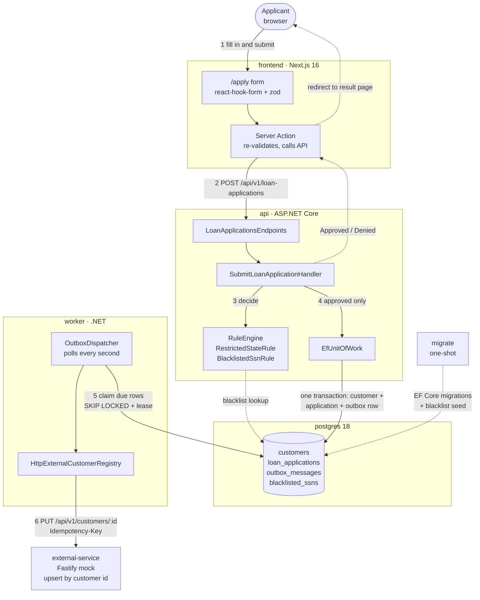
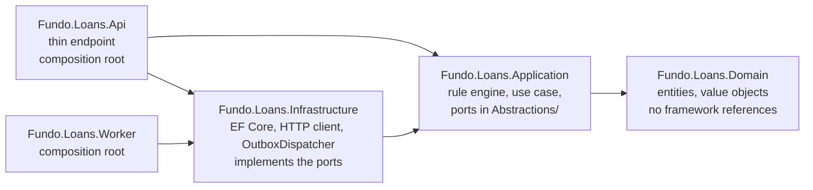

# Architecture

Interactive diagrams (open the HTML in a browser; each `.archify.json` is its source):
[architecture](../docs/architecture/architecture.html) · [submit + outbox sequence](../docs/sequence/sequence.html).

## Structure and layers

### Runtime: containers and the request/event flow



Steps 1–4 happen inside the HTTP request and answer the user. Steps 5–6 run later in the separate
worker process, so the external service never affects the response.

### Code: projects and dependency direction



Arrows mean "references". Dependencies point inward. Domain references only the base class library, and Application
references only Domain plus `Microsoft.Extensions` DI, options and logging. Both rules are enforced by
`ArchitectureTests` in the unit test projects.

| Folder | Responsibility |
|---|---|
| `backend/src/Fundo.Loans.Domain` | Entities `Customer`, `LoanApplication`, `OutboxMessage`; value objects `Ssn`, `Money`, `Address`, `PersonName` that reject invalid state; `Decision`. |
| `backend/src/Fundo.Loans.Application` | `Decisioning/`: rule engine and rules. `LoanApplications/`: the single use case, `SubmitLoanApplicationHandler`. `Abstractions/`: the ports it needs (two repositories, `IUnitOfWork`, `IOutboxWriter`, `ISsnHasher`, `ISsnBlacklist`, `IExternalCustomerRegistry`). `Contracts/`: the event payload. |
| `backend/src/Fundo.Loans.Infrastructure` | Adapters for those ports: EF Core + Npgsql (`LoansDbContext`, migrations, repositories, `EfUnitOfWork`), `HmacSsnHasher`, `HttpExternalCustomerRegistry`, `OutboxDispatcher`. |
| `backend/src/Fundo.Loans.Api` | Composition root plus one thin endpoint (request → command → handler → HTTP result). Also runs migrations when started with `migrate`. |
| `backend/src/Fundo.Loans.Worker` | Composition root that runs only `OutboxDispatcher`. |
| `frontend/` | `/apply` form (react-hook-form + zod), a Server Action that re-validates and calls the API, and `/result/approved` and `/result/denied` pages. |
| `external-service/` | Fastify mock with `PUT /api/v1/customers/:id` (upsert) and `GET` endpoints to see what it received. |

There are two repositories because the use case loads two aggregates (a customer by SSN hash, an
application by customer). There is no generic repository, mediator or CQRS: one handler does not need them.

## Rule engine

`RuleEngine` runs every registered `IDenyRule` in `Order`. The first rule that returns a denial
wins; if none does, the application is approved. Shipped rules:
`RestrictedStateRule` (`RESTRICTED_STATE`, states read from config, default `["NY"]`) and
`BlacklistedSsnRule` (`BLACKLISTED_SSN`, compares the SSN hash against the `blacklisted_ssns` table).

**To add a rule**, write one class and register it with one line. The engine and the existing
rules do not change.

```csharp
public sealed class MaximumAmountRule : IDenyRule          // Application/Decisioning/MaximumAmountRule.cs
{
    public string Code => "AMOUNT_TOO_HIGH";
    public int Order => 30;
    public Task<Decision> EvaluateAsync(DecisionRequest request, CancellationToken ct) =>
        Task.FromResult(request.RequestedAmount.Amount > 500_000m
            ? Decision.Deny(Code, "Requested amount is above our limit.")
            : Decision.Approve());
}

services.AddDenyRule<MaximumAmountRule>();                 // Application/DependencyInjection.cs
```

## Submitting an application

`SubmitLoanApplicationHandler.HandleAsync`:

1. Builds the value objects. Invalid input returns `SubmissionOutcome.Invalid` with per-field
   errors, and the endpoint answers **400**. The frontend validates with the same zod schema
   before calling, so this is a server-side safety net.
2. Runs the rule engine. On a denial it returns `Denied` with the rule code. **Nothing is saved
   and no event is written.**
3. On approval, inside **one** `IUnitOfWork.ExecuteAsync` transaction:
   - finds the customer by SSN hash, then calls `Customer.Register` for a new one or `UpdateDetails` for a returning one;
   - finds that customer's application, then calls `LoanApplication.Open` or `ChangeRequestedAmount`;
   - enqueues an `OutboxMessage` whose payload has `operation` set to `create` or `update`.

### Transaction and failure behaviour

"Publishing the event" means inserting the outbox row with the same `SaveChanges` and in the same
transaction as the customer and the application. So all three are committed together or none is.

| Failure | Outcome |
|---|---|
| DB error while saving or committing (constraint, connection) | `EfUnitOfWork` rolls back: no customer, no application, no event. The API returns 500, and resubmitting is safe because the operation is keyed by SSN. Covered by `UnitOfWorkTests`. |
| Two first-time submissions with the same SSN at the same moment | The unique index on `customers.ssn_hash` rejects the second insert. `EfUnitOfWork` rolls back, clears the change tracker and throws `ConcurrencyConflictException`. The handler retries once, finds the customer and updates it. Both requests succeed, with one customer and one application. Covered by `Post_SameSsnConcurrently_…`. |
| External service down or slow (after commit) | The request already succeeded. The worker retries with exponential backoff (2, 4, 8… seconds, capped at 60) and dead-letters the event after 5 attempts (`OutboxMessage.RecordFailure`). |
| Worker crashes after the HTTP call but before marking the event processed | The event becomes due again when its claim lease expires and is delivered again. This is safe because the external call is idempotent (see below). |

## Background event and the external service

`OutboxDispatcher` is a `BackgroundService` that runs only in the **worker** process. It never runs
inside the HTTP request that answers the form. Every second it claims up to 10 due events with a
single statement:

```sql
UPDATE outbox_messages SET next_attempt_at = now + lease
WHERE id IN (SELECT id FROM outbox_messages
             WHERE processed_at IS NULL AND dead_lettered_at IS NULL AND next_attempt_at <= now
             ORDER BY occurred_at LIMIT 10 FOR UPDATE SKIP LOCKED)
RETURNING *
```

The claim commits immediately. Row locks last only for that statement, never during HTTP calls.
The lease (2 minutes, which is more than 10 × the 5-second HTTP timeout) hides claimed events from
other workers, so `docker compose up --scale worker=2` delivers each event exactly once in normal
operation. `OutboxDispatcherTests` proves this with two concurrent dispatchers. Each event is then
sent through `IExternalCustomerRegistry` and marked processed or failed.

**Contract:** `PUT /api/v1/customers/{customerId}` with header `Idempotency-Key: <outbox message id>`
and body `{ customer, application, operation: "create" | "update", occurredAtUtc }`. The mock
answers `200`.

- **Why `PUT` rather than `POST` + `PATCH`:** delivery is at-least-once, so the call must be
  idempotent. Our customer id is a stable key, so "upsert by id" covers both new and returning
  customers with one code path, and sending it twice is harmless. `operation` tells the receiver
  which case applies.
- **Ordering:** a retried older event can arrive after a newer one. The receiver keeps the record
  with the latest `occurredAtUtc` and ignores the stale one.
- **Retries:** only the outbox retries, with backoff and dead-lettering. The `HttpClient` does not
  retry, which keeps timing easy to reason about.

**Why the worker is a separate process:** a slow or failing external service can never use API
threads or connections, and delivery can be scaled or restarted without touching request handling.
The cost is one more container, which shares the Infrastructure project and the database.

## Additions beyond the brief, and why each exists

| Addition | Why |
|---|---|
| SSN stored as HMAC-SHA256 hash + last 4 digits (`HmacSsnHasher`, key from `SSN_HASH_PEPPER`) | SSNs are highly sensitive. A deterministic keyed hash still allows the "same SSN = same customer" and blacklist lookups without ever storing the number. Logs only print `***-**-1234`. |
| `migrate` one-shot service and two DB roles | The api and worker connect with a role that cannot change the schema. Only committed EF Core migrations, applied by the schema-owner role, can. |
| Hardened containers (non-root, read-only filesystem, no capabilities; Postgres not published) | A few lines of compose configuration. |
| CSP with a per-request nonce (`frontend/src/proxy.ts`, the Next.js 16 replacement for `middleware.ts`) | The form collects SSNs. A static `script-src 'self'` would block Next.js hydration, so the nonce is what lets a strict policy coexist with client-side validation. |
| Serilog JSON logs + `/health/live` and `/health/ready` | Readable logs for the demo, plus the health checks Compose uses to start services in order. |

## Trade-offs: left out on purpose

- **OpenTelemetry tracing and metrics, rate limiting, CORS:** useful in production, but no part of
  the brief needs them. The browser never calls the API (only the Server Action does), so CORS and
  rate limiting would protect a port that is published only for reviewers.
- **Message broker:** the transactional outbox already guarantees the event is written exactly when
  the data is. A broker would add infrastructure for one consumer.
- **E2E browser tests, load tests, CI pipeline:** the endpoint, transaction and dispatcher are
  covered against real PostgreSQL; the demo video shows the UI flows. `make check` is the single
  local gate.
- **Dead-letter replay tooling:** dead-lettered events keep `last_error` in the table. Replaying one
  is a manual `UPDATE` until there is a real need.
- **Mock persistence:** the external service is in-memory by design; it only has to return 200 and
  show what it received.
